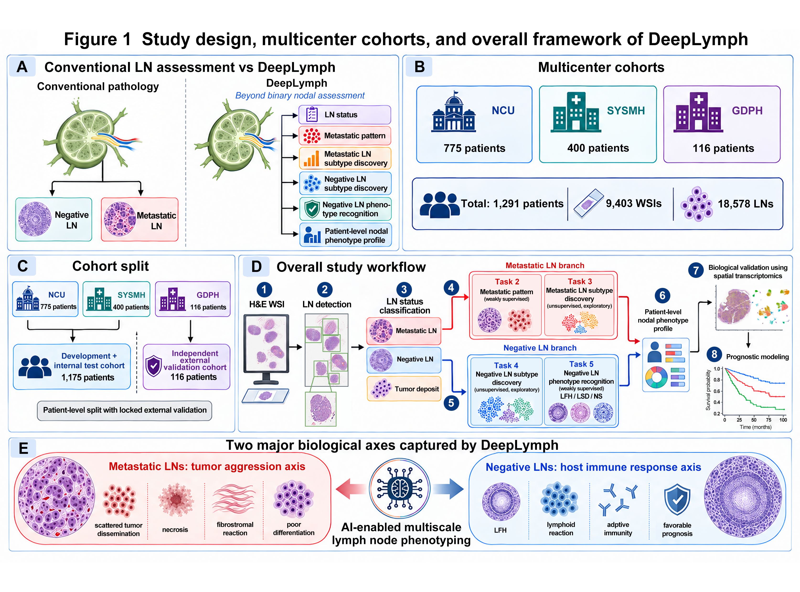
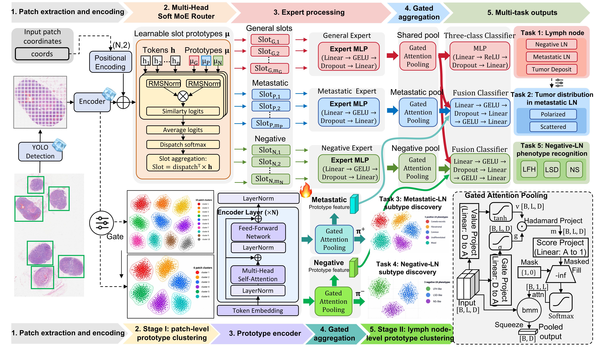

# DeepLymph

DeepLymph is a multiscale computational-pathology framework for H&E-based
regional lymph-node phenotyping and prognostic stratification in colorectal
cancer. It combines lymph-node localisation, multi-task phenotype prediction,
prototype-based morphological analysis, and patient-level nodal profiling.

## Overall framework

The framework extends conventional lymph-node assessment beyond metastatic
status to characterize metastatic patterns, metastatic and negative
lymph-node phenotypes, and their patient-level prognostic relevance.

## SoftMT-MoE model architecture

SoftMT-MoE routes patch representations to general, metastatic, and negative
expert branches for multi-task prediction. Separate prototype-learning routes
support exploratory morphological subtype discovery in metastatic and negative
lymph nodes.

## Code and data availability

The implementation, model configurations, and documentation will be released
upon publication. Whole-slide images and patient-level clinical data are not
publicly available because of privacy and institutional data-governance
requirements.
